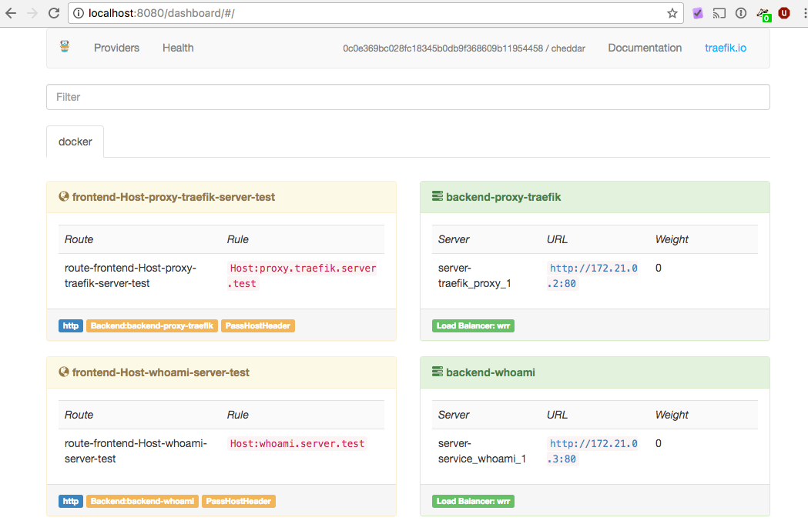

Traefik - The modern reverse proxy 
A getting started guide

# Intro

Imagine you have a set of microservices or applications that you want to publish to the world. There are several alternatives out there that you can choose from. Most of the reverse proxies were created when container technology was not around, so you have to jump through some loops to get going. As an broadly used example we will have a peak at how to configure nginx and some of it’s downsides. To get our hands dirty we have a more detailed walk-through of the modern, dynamic Traefik reverse proxy which we will use to deploy some services.

# Best in class before Docker: Nginx

There is quite a number of Container Deployments out there that use [nginx](http://nginx.org/) as a front end. The configuration is easy to read and write and the C style syntax gives you a cozy feeling. A simple config to deploy a service might look like this:

	worker_processes 4;
	events { worker_connections 1024; }
	 
	http {
	 
	upstream upstream-servers {
	              least_conn;
	                 server container1:80 weight=10 max_fails=3 fail_timeout=30s;
	                 server container2:80 weight=10 max_fails=3 fail_timeout=30s;
	                 server container1280 weight=10 max_fails=3 fail_timeout=30s;
	            }
	         
	            server {
	                 listen 80;
	         
	                 location / {
	                        proxy_pass http://upstream-servers;
	                        proxy_http_version 1.1;
	                        proxy_set_header Host $host;
	                    proxy_cache_bypass $http_upgrade;
	                     }
	                }
	}

With this config we created a simple HTTP reverse Proxy on port 80. Nginx will answer the requests by forwarding these to the upstream servers. The container with the least number of active connections will be chosen from the pool. Nice configuration. Plain and easy to read. 

One thing you will encounter when you deploy nginx in a mutable container enviroment is that you can’t replace containers without at least reloading the nginx configuration although the container DNS name is still the same. Nginx will cache the IP address to the container and you have to manually take care of it. You can work around this problem in many ways but still you have to take care of it. 
Don't get me wrong: I don't want to pick on nginx. I like it and used it a lot before I switched to [Traefik](https://traefik.io/) as my go to solution.

# Traefik

There’s a more modern reverse proxy around that is able to handle dynamic container environments: [Traefik](https://traefik.io/). It is a small application written in [GO](https://golang.org/ "Go") tailored for the new challenges. You can use it as a frontend in a variety of environments. The simpler ones are [Docker](https://www.docker.com/) and Docker Swarm up to the more complex ones like [Apache Mesos](https://mesos.apache.org/) or [Kubernetes](https://kubernetes.io/ "Kuberntes"). You can even read meta data from directory services like [etcd](https://coreos.com/etcd/ "etcd") or [Consul](https://www.consul.io/). 

Back to our application we want to deploy. Let’s imagine we have a set of services that are described in a [Docker Compose ](https://docs.docker.com/compose/)file. We can wire up our services and deploy these. Here we can have a look at a simple configuration:

version: '3.1'
services:
  whoami:
    image: emilevauge/whoami
    restart:
      always
    ports:
      - "80:80"

This configuration will start the [whoami](https://hub.docker.com/r/emilevauge/whoami/) test image that will allow us to see our requests in a kind of echo chamber. You can start it with `docker-compose up` and call it with your browser. How can we deploy it on a specific virtual host? Let’s extend the configuration a bit by adding Docker labels.

	version: '3.1'
	services:
	 whoami:
	   image: emilevauge/whoami
	   networks:
	     - web
	   labels:
	     - "traefik.backend=whoami"
	     - "traefik.frontend.rule=Host:whoami.server.test"
	   restart:
	     always
	networks:
	 web:
	   external:
	     name: traefik_webgateway

This is the configuration needed for Traefik to deploy our service at http://whoami.server.test . Pretty straight forward.

When you followed the example closely you might ask where Traefik is involved and you are right. Next we need to spin Traefik itself up:

	version: '2'
	
	services:
	  proxy:
	    image: marcopaga/traefik:1.3.5.2
	    command: --web --docker --docker.domain=server.test --logLevel=INFO
	    networks:
	      - webgateway
	    ports:
	      - "80:80"
	      - "8080:8080"
	    volumes:
	      - /var/run/docker.sock:/var/run/docker.sock
	      - /dev/null:/traefik.toml
	    restart:
	          always
	
	networks:
	  webgateway:
	    driver: bridge

The config above takes care of starting Traefik and will connect to the hosting docker deamon to retrieve the needed meta data. It will scan for docker containers that are marked with labels and will publish the services accordingly. The connection is kept so that changes will be reflected without any delay.

Both services are wired together using a docker network called call webgateway that is prefixed by the project name. If no project name is specified the name is inferred by the directory name where the compose file is located.

You can find more configuration options on the documentation site: [https://docs.traefik.io/toml/#docker-backend](https://docs.traefik.io/toml/#docker-backend "Docker Backend"). This takes you straight to a backend configuration part. Below that there is a list of Docker labels that can be used to further configure the publishing of the services. Currently we just used traefik.backend and traefik.frontend.rule in the sample above but you can find more.

Once Traefik and the service are up you can connect to the service and test the deployment. Make sure you first start Traefik in this example because the config provides the network the services can connect to.
Have a look at the built in dashboard by pointing your browser to: `http://localhost:8080/`

Here you can see what services are deployed and how these are configured. You see that our service is available as whoami.server.test. But since we don’t have a DNS record pointing from this name to our localhost we need to manually set the [Host header](https://www.w3.org/Protocols/rfc2616/rfc2616-sec14.html#sec14.23) and call the localhost.

> curl -H Host:whoami.server.test http://localhost -v

Once you entered the command you can see the request that is being sent to Traefik and the response that will be returned. The result will look similar to:

	  ~ curl -H Host:whoami.server.test http://localhost
	Hostname: 2f3de5835785
	IP: 127.0.0.1
	IP: 172.21.0.3
	GET / HTTP/1.1
	Host: whoami.server.test
	User-Agent: Mozilla/5.0 (Windows NT 6.1; rv:45.0) Gecko/20100101 Firefox/45.0
	Accept: */*
	Accept-Encoding: gzip
	Referer:
	X-Forwarded-For: 172.21.0.1
	X-Forwarded-Host: whoami.server.test
	X-Forwarded-Proto: http
	X-Forwarded-Server: b2554c36ab87

# DNS

To fully enjoy the power of Traefik you need to take care of the DNS records of your deployments. But this is a one time setup so don’t worry about it too much. One deployment we run at a customer consists of two DNS records per host. One is an A record pointing to the IP Address of the host. And the other is a CNAME record that catches all virtual hosts below this one and forwards it to the A entry. This is a simple way to locate our services.
Just a little example to show you the setup:

	server.test A 172.16.2.10
	*.server.test CNAME server.test

This will allow us to reach our server as server.test and whatever.server.test, youwant.server.test. When you access the site with your favorite tool like a REST service, httpie or a browser the client will forward the target host in a HTTP header called Host. Traefik will find the right container based on this header to forward the request to.

One advantage of using virtual hosts is that you don’t need to take extra care of redirects in your web application. We ran into problems when using relative paths for deployments because nobody thought about that being an option. Once you have your environment set up you can deploy the services as you like.

# Scaling out

Deploying a single container is easy and we could achieve it without any great effort. But what about scaling out? What part of the config do I have to change? The simple answer is: You don’t have to change your config. Just simply spin up more containers and that’s it. In our simple example:

	docker-compose scale whoami=4

This command will spin up four containers that will get added to the load balancer instantly. You can verify it by hitting the endpoint repeatedly and see the container name change and by having a look at the dashboard that is located on port 8080. 

# Sticky Sessions

Clearly I would strive for a stateless application backend that can be scaled independently and without any restrictions regarding the service endpoint. 
Sometimes you don't have the freedom because you are running a session based  application that doesn't distribute the sessions in a cluster of servers. Or - if you think more of REST services - you heavily use caching of resources and you want your sessions pinned to a specific container. No matter why you want your clients to be pinned to a specific Docker container, there is an easy configuration switch to handle it:

	traefik.backend.loadbalancer.sticky=true

This will check for a session cookie with a specific backend as a value. If the cookie is present and the backend is up the request will be forwarded there. If the backend is down another is chosen.
Be sure to use the upcoming 1.4 version for this feature or my patched Docker image (marcopaga/traefik:1.3.5.2) if you want to use this feature. Before these versions the cookie path wasn't specified so that clients tended to drop the cookie once in while depending on the request path.

# Closing
I’m pretty sure: It became clear how simple life can be when it comes to the deployment of your services and web applications with Traefik.